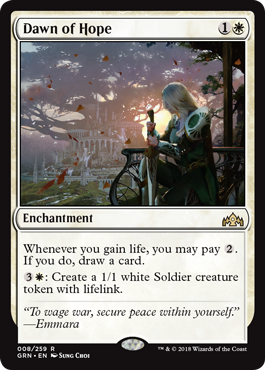
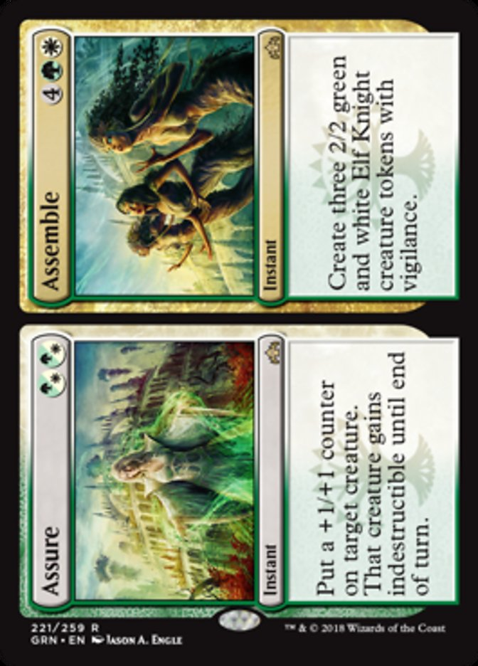

```{r setup, include=FALSE}
knitr::opts_chunk$set(echo = TRUE)
```

# Magic: The Gathering

Two years ago I was in the midst of starting a gut rehab on my home, starting a new job, and ramping up PERRO's lead in the water campaign.  Someone suggested that it might be good to do something that wasn't productive to relax.  In this midst of this presidency, a lot of activists are getting burnt out, and the reaction to that has been to remind people that [self-care is an act of political warfare](https://www.bitchmedia.org/article/audre-lorde-thought-self-care-act-political-warfare).  I had just heard a [Planet Money ](https://www.npr.org/sections/money/2015/03/11/392381112/episode-609-the-curse-of-the-black-lotus) podcast about Magic and I was blown away that it was still huge!

After a 2 decade hiatus, I started playing again, online and at [my local game store](https://www.facebook.com/firstaidtaylor/).  To no one's surprise, the game has changed a bit over 2 decades. While I enjoy playing the game, I had no interest in studying up and no interest in filling in 2 decades of a missing collection.  I was just trying to have fun.  So I played the flavor of the game that only used a limited set of the most recent cards; *Sealed Standard*.

Sealed standard is the flavor of the game where you open 6 packs of random cards and build a small deck using 40 cards.  Then you play other people who do the same thing.  It's a great way to play without all of the commitment and to get to know the newest iteration of the game.

# Optimization

After some time I realized that building a reasonable deck with a random assortment of cards is an optimization problem of the variety that I studied while getting my Master's degree in game theory.  It's also very, very similar to [a previous blog post](https://troyhernandez.com/2016/01/06/optimizing-fanduel-in-r/) of selecting a fantasy football team for daily fantasy football.

So I wrote the algorithm up, played around with it, made it into [an app](https://troyhernandez.shinyapps.io/SealedMTG/), and posted it on [the Magic sub-reddit](https://troyhernandez.shinyapps.io/SealedMTG/) in hopes that others might find it useful and I could make a little cash on the side... that didn't happen.  It was pointed out that using this algorithm in a competitive setting was against the rules; specifically, [tournament rules section 2.11 and 2.12](https://wpn.wizards.com/sites/wpn/files/attachements/mtg_mtr_13jul18_en_0.pdf).

Womp, womp.  No beer money for me!  Regardless, it's interesting enough that I figured if can't make money off of it, I should at least open source it for a teachable moment.  And after all, in these times of Nazi resurgances, we need to teach people [how to beat Nazis](https://en.wikipedia.org/wiki/Linear_programming#History) again!  Seriously though, in my last 5 years in industry, using these algorithms have blown so many people way and generated so much revenue that it's clear that these algorithms and this field needs more attention!  And the release of the Guilds of Ravnica set provided a great opportunity.

<!-- Side note: I also recently stumbled upon [this great function](https://berndschmidl.com/?p=182) that allows me to post to my blog directly to WordPress using the R programming language!  Given that I wrote the algorithm and the app in R, this was a great opportunity to try it out for myself. -->

What follows is an algorithm for building an optimal Magic The Gathering standard sealed deck using linear programming.  I also wrote up a quadratic programming version of it, but getting it to work required proprietary libraries... I'm sure my employer will look forward to that iteration.  If you want to see the code, or add to it, or modify it, it's on [my github.](https://github.com/TroyHernandez/MTGcsv)

# The Algorithm

If you're really interested but don't know about linear programming, there are plenty of resources online.  [Here's Wikipedia](https://en.wikipedia.org/wiki/Linear_programming) to get you started.  This isn't going make you a pro, but it will help you be competitive.  This is also a very basic version of the algorithm.  It doesn't account for interactions between cards; e.g. lifelink cards won't be valued more if you include [Dawn of Hope](http://gatherer.wizards.com/Pages/Card/Details.aspx?multiverseid=452758) in your deck.  Last time I had a linear implementation of this, but this is more naturally solved using quadratic programming.




## Data

> Data! Data! Data! I can't make bricks without clay.
- Sherlock Holmes

I'm happy to report that [mtgjson.com](https://mtgjson.com/) has most of the data required.  It took a little bit of effort to parse the structure of the json (as a data scientist, I dislike json), but eventually I got what I needed.  You can [download the zip from here](https://mtgjson.com/json/AllSets.json.zip).  As always, you can download the file with code, but I got excited and started clicking away :)

I used the `jsonlite` package to parse the data and then flattened it out.  We want one row per card.

```{r, eval = FALSE}
install.packages("jsonlite")
library(jsonlite)
mtg <- read_json(path = "AllSets.json")

# Doing some checks on the structure
length(mtg[[which(names(mtg)=="GRN")]])
names(mtg[[which(names(mtg)=="GRN")]])


GRN <- mtg$GRN$cards
col.names.GRN <- unique(unlist(lapply(GRN, names)))  

GRN.flat <- data.frame(matrix("", ncol = length(col.names.GRN), nrow = length(GRN)),
                        stringsAsFactors = FALSE)
colnames(GRN.flat) <- col.names.GRN

for(i in 1:length(GRN)){
  for(j in 1:ncol(GRN.flat)){
    if(sum(names(GRN[[i]])==col.names.GRN[j])){
      GRN.flat[i, j] <- GRN[[i]][[which(names(GRN[[i]])==col.names.GRN[j])]]
    }
  }
}
GRN.clean <- GRN.flat[, c("name", "rarity", "colorIdentity", "types", "cmc")]
```


Now we want to clean things up for our linear programming 

```{r, eval = FALSE}
GRN.clean <- cbind(GRN.clean, "score" = 0,
                   "B" = 0, "G" = 0, "R" = 0, "U" = 0, "W" = 0,
                   "quantity" = 0)

# Some of the colors identities got dropped in the flattening, so this:
for(i in 1:length(GRN)){
  card <- GRN[[i]]
  for(j in 1:length(card$colorIdentity)){
    GRN.clean[i, card$colorIdentity[[j]]] <- 1
  }
  if(length(card$colorIdentity) > 1){
    GRN.clean[i, "colorIdentity"] <- "M"
  }
}

# Fixing "colorIdentity" to handle these how we want them to
GRN.clean[which(GRN.clean$type == "Land"), "colorIdentity"] <- "Land"
GRN.clean[which(GRN.clean$type == "Artifact"), "colorIdentity"] <- "Artifact"

# We want artifact creatures as creatures for the optimization
GRN.clean[which(lapply(sapply(GRN,function(x) x["types"]), length)>1),
          "types"] <- "Creature"

# We don't want basic lands to be optimized, you can figure that out yourself
basic.land <- which(GRN.clean$rarity=="Basic Land")
GRN.clean <- GRN.clean[-basic.land, ]

# Next time I should remember to delete Planeswalker deck cards before reordering
# Finally I have to reorder to be able to copy down scores by hand more easily
GRN.clean <- GRN.clean[order(GRN.clean$colorIdentity, GRN.clean$name), ]

write.csv(GRN.clean, "GRN.csv", row.names = FALSE)
```

The above data is enough to define the problem constraints matrix, but I needed some card rankings to define the objective function.  In trying to get a friend unacquainted to Magic to play, I stumbled upon [Magic Community Set Review](https://www.mtgcommunityreview.com/).  Of course, this site is build using javascript, so scraping the data was going to be a headache.  Instead of doing that, I spent about 20 minutes just copying the scores manually.  No programming wizardry there, just good ol' manual labor.  I could complain that, for a site dependent upon the community's input, it's frustrating that Magic Community Set Reviews makes it extremely difficult to download the reviews, but that's for another day.

There was also some cleaning up to do with the rows of the csv.  The planeswalker cards had to be removed and cards like *Assure/Assemble* had two rows that had to be combined into one.




```{r, eval = FALSE}
# Read back in and sort by color and cmc
GRN.clean <- read.csv("GRN.csv")
GRN.clean <- GRN.clean[order(GRN.clean$colorIdentity, GRN.clean$cmc), ]
write.csv(GRN.clean, "GRN.csv", row.names = FALSE)
```


## Code

At this point we have the data we need.  Now to optimize!

First you'll need to open your six packs of cards and fill in the number of cards you drafted in the `quantity` column and save.  I saved mine as `GRN_180927.csv`.  We also need to load in some standard settings; e.g. number of colors in the deck and number of non-land cards.

```{r}
source("MTG/MTGopt_funcs.R")
draft <- read.csv("GRN_180927.csv", stringsAsFactors = FALSE)

num.colors <- 2
num.non.land <- 23
```

Above, I also loaded in a script `MTGopt_funcs.R`.  I'll explain the two main functions there.  The function `optimize.colors` is where all the work is done.  First we load in the `lpSolve` package.  Then we pick out the colors of the deck that we want to optimize.  Then we set constraints.  I'm using the excellent [Shadows Over Innistrad Prerelease Primer](https://magic.wizards.com/en/articles/archive/feature/shadows-over-innistrad-prerelease-primer) to determine the number of creatures at each converted mana cost (cmc) that we want; i.e. `creature.curve`.  We add in [slack variables](https://en.wikipedia.org/wiki/Slack_variable) to allow for deviations from that standard; i.e. `creature.slack.mat`.  Without the slack variables, if we didn't have any 1 cmc creatures, the function would return an error.  The penalty for deviating from the recommendations in the primer is determined by the `curve.penalty`.  Additionally there is a `removal.penalty`.  That penalizes your deck for not having enough removal.  I don't have the time to manually encode which cards are removal cards, but if you want to add that to the `GRN.csv` send me a pull request!  With 17 lands and 19 creatures prescribed, I hard-coded 4 removal spells to get up to the 40 card deck, but that could also be a variable.

```{r, eval = FALSE}
library("lpSolve")

optimize.colors <- function(i, draft, deck.color.ind,
                            num.non.land = 23,
                            curve.penalty = 5,
                            removal.penalty = 5,
                            Mtg.colors = c("B", "G", "R", "U", "W"),
                            tribes = c("Artifact", "Ramp", "Goblin", "Dragon",
                                       "Lifelink", "Weenie", "Zombie"),
                            tribal.boost = rep(0, length(tribes))){
  remove.colors <- c(i)
  # Take out cards with other colors
  colors.ind <- which(rowSums(draft[, Mtg.colors[-deck.color.ind[i,]]]) == 0)
  colors.mat <- draft[colors.ind, ]
  
  if(!is.null(tribes)){
    for(j in 1:length(tribes)){
      if(sum(draft[, tribes[j]] == 2) > 0){
        tribe.ind <- which(colors.mat[, tribes[j]] > 0)
        colors.mat[tribe.ind, "score"] <- colors.mat[tribe.ind, "score"] + tribal.boost[j]
      }
    }
  }
  # We are trying to maximize the collective score
  f.obj <- c(colors.mat$score)
  # adding in creature curve
  f.obj <- c(f.obj, rep(-1 * curve.penalty, 12))
  # adding in removal requirement
  f.obj <- c(f.obj, -1 * removal.penalty)
  
  
  # We can only select the cards we have, the constraint will be on the rhs
  f.con <- diag(1, nrow = nrow(colors.mat), ncol = nrow(colors.mat))
  # We need to have 23 non-land cards
  non.land.vec <- rep(1, nrow(colors.mat))
  non.land.vec[which(colors.mat$types == "Land")] <- 0
  f.con <- rbind(f.con, non.land.vec)
  # Add in creature curve 
  creature.mat <- matrix(0, ncol = nrow(colors.mat), nrow = 6)
  creature.mat[1, which(colors.mat$types == "Creature" & colors.mat$cmc == 1)] <- 1
  creature.mat[2, which(colors.mat$types == "Creature" & colors.mat$cmc == 2)] <- 1
  creature.mat[3, which(colors.mat$types == "Creature" & colors.mat$cmc == 3)] <- 1
  creature.mat[4, which(colors.mat$types == "Creature" & colors.mat$cmc == 4)] <- 1
  creature.mat[5, which(colors.mat$types == "Creature" & colors.mat$cmc == 5)] <- 1
  creature.mat[6, which(colors.mat$types == "Creature" & colors.mat$cmc > 5)] <- 1
  f.con <- rbind(f.con, creature.mat)
  # Add in slack.mat
  creature.slack.mat <- matrix(0, nrow = 6, ncol = 12)
  creature.slack.mat[cbind(1:6, seq(1, 11, 2))] <- 1
  creature.slack.mat[cbind(1:6, seq(2, 12, 2))] <- -1
  f.con <- cbind(f.con,
                 rbind(matrix(0, nrow = nrow(f.con) - nrow(creature.slack.mat),
                              ncol = 12),
                       creature.slack.mat))
  # Add in removal requirement
  removal.vec <- c(colors.mat$Removal, rep(0, length = ncol(f.con) - length(colors.mat$Removal)))
  f.con <- rbind(f.con, removal.vec)
  f.con <- cbind(f.con, c(rep(0, nrow(f.con) - 1), 1))
  
  # The constraint to only pick cards we have
  f.dir <- c(rep("<=", nrow(colors.mat)), rep("==", 7), ">=")
  
  # Using the cards we have for the RHS
  creature.curve <- c(1, 5, 4, 4, 3, 2)
  min.removal <- 4
  f.rhs <- c(colors.mat$quantity, num.non.land, creature.curve, min.removal)
  
  all.int <- TRUE
  
  fit <- lp("max", f.obj, f.con, f.dir, f.rhs, all.int = TRUE)
  
  cards <- cbind(colors.mat, quantity.used = fit$solution[1:nrow(colors.mat)])

  unused.cards <- cards[which(cards$quantity > cards$quantity.used), ]

  deck <- cbind(colors.mat[which(fit$solution[1:nrow(colors.mat)] != 0),],
                quantity.used = fit$solution[which(fit$solution[1:nrow(colors.mat)] != 0)])
  fit.deck <- list(fit = fit, deck = deck, unused.cards = unused.cards)
}
```

The second important function is one that tests every color combination.  You'll see some of the "tribes" from the last set that I used this algorithm on; M19.  That's some more hand-coding into the `GRN.csv` that'd have to be done, but again, no time right now.

```{r, eval = FALSE}
optimize.draft <- function(draft, num.colors, num.non.land,
                           curve.penalty = 5, removal.penalty = 5,
                           deck.choice = "Best",
                           tribes = c("Artifact", "Ramp", "Goblin", "Dragon",
                                      "Lifelink", "Weenie", "Zombie"),
                           tribal.boost = rep(0, length(tribes))){
  Mtg.colors <- c("B", "G", "R", "U", "W")
  deck.colors <- t(combn(Mtg.colors, num.colors))
  deck.color.ind <- t(combn(1:5, num.colors))
  objective.values <- data.frame(deck.colors, obj.val = rep(0, nrow(deck.colors)))
  # subset mat
  for(i in 1:nrow(objective.values)){
    fit.deck <- optimize.colors(i = i, draft = draft,
                                deck.color.ind = deck.color.ind,
                                num.non.land = num.non.land,
                                curve.penalty = curve.penalty,
                                removal.penalty = removal.penalty,
                                tribes = tribes,
                                tribal.boost = tribal.boost)
    objective.values[i, "obj.val"] <- fit.deck$fit$objval
  }
  ov.colors <- apply(objective.values[, -ncol(objective.values)],
                     1, paste0, collapse = "")
  obj.vals <- data.frame(colors = ov.colors, value = objective.values$obj.val)
  
  if(deck.choice == "Best"){
    fit.deck <- optimize.colors(i = which.max(objective.values$obj.val),
                                draft = draft,
                                deck.color.ind = deck.color.ind,
                                num.non.land = num.non.land,
                                curve.penalty = curve.penalty,
                                removal.penalty = removal.penalty,
                                tribes = NULL, #c("Artifact", "Ramp", "Goblin", "Dragon",
                                           # "Lifelink", "Weenie", "Zombie"),
                                tribal.boost = tribal.boost)
  } else {
    fit.deck <- optimize.colors(i = which(obj.vals$colors == deck.choice),
                                draft = draft,
                                deck.color.ind = deck.color.ind,
                                num.non.land = num.non.land,
                                curve.penalty = curve.penalty,
                                removal.penalty = removal.penalty,
                                tribes = NULL, # c("Artifact", "Ramp", "Goblin", "Dragon",
                                           # "Lifelink", "Weenie", "Zombie"),
                                tribal.boost = tribal.boost)
  }
  
  obj.vals <- obj.vals[order(obj.vals$value, decreasing = TRUE), ]
  
  # tribal.table <- rbind(colSums(fit.deck$deck[which(fit.deck$deck$quantity != 0), tribes] == 1),
                        # colSums(fit.deck$deck[which(fit.deck$deck$quantity != 0), tribes] == 2))
  # rownames(tribal.table) <- c("Followers", "Commanders")
  fit.deck <- list(fit.deck = fit.deck,
                   objective.values = obj.vals) # ,
                   # tribal.table = t(tribal.table))
}
```

Lastly, we put it all together with just one function!

```{r}
fit <- optimize.draft(draft = draft,
               num.colors = num.colors,
               num.non.land = 40 - 17,
               curve.penalty = 2.5,
               removal.penalty = 0,
               deck.choice = "Best",
               tribes = NULL)

fit$fit.deck$deck[, c(1, 3:6, 12:13)]
```

There are some extras that I put in there for diagnostics.  I put in the unused cards of that color in the likely event you want to swap out a card or two.  I also put in all of the objective functions so you can compare the value of each color combination.  Of course this is all coded into [a shiny app](https://troyhernandez.shinyapps.io/SealedMTG/).  But that's another blog post... or you can explore [the repo](https://github.com/TroyHernandez/MTGcsv).

Anyhow, I hope you learned a little about the glory of linear programming and R in your attempt to get a leg up on the competition.  I used this to create two decks yesterday; mostly the Boros deck above and the Black/Green/White deck if you turn down the penalty curve all the way.  I had 2 wins and 3 losses.  Obviously, in addition to the inherent randomness that makes Magic so fun, it's not perfect.